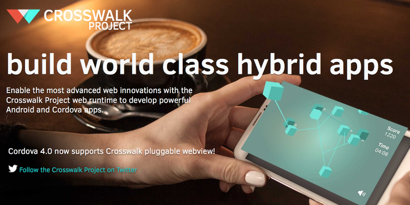

# crosswalk-embedded

This repository contains example of Crosswalk embedding to Android project.

More details about this demo you can find in following articles (in Russian):
* [Crosswalk Project — replacement for Android WebView. Integration in project](http://habrahabr.ru/post/263649/)
* [Crosswalk Project — replacement for Android WebView. Issues of integration](http://habrahabr.ru/post/263655/)

Please let me know if you need translation in English.
